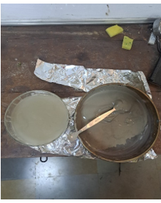
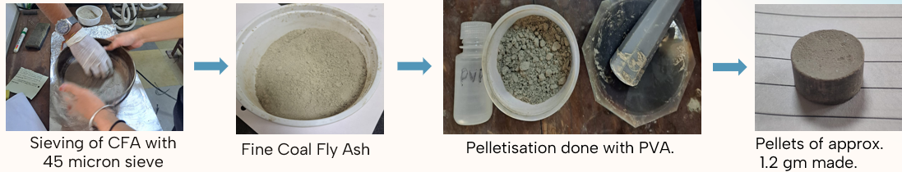
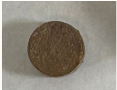
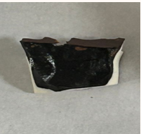
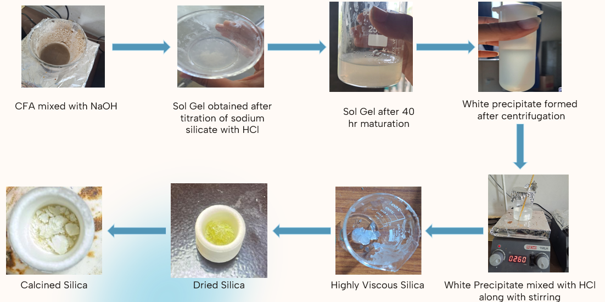

# Coal Fly Ash Valorization: Vitrification and Silica Recovery

An experimental materials-processing project exploring **thermal treatment, vitrification, and silica recovery from coal fly ash (CFA)** as potential pathways for industrial-waste valorization.

**Project:** B.Tech Mini Project  
**Institution:** COEP Technological University  
**Year:** 2024

---

## Overview

Coal fly ash is a major industrial by-product generated during coal combustion. Conventional disposal methods require significant land area and can create environmental concerns.

At the same time, CFA contains potentially valuable inorganic constituents, particularly silicon- and aluminum-containing phases.

This project investigated two approaches for CFA utilization:

1. **Thermal treatment and vitrification** for physical transformation and volume reduction
2. **Alkali-assisted sol-gel processing** for recovery of silica as a value-added material

The overall objective was to explore coal fly ash not only as an industrial waste stream, but also as a potential **secondary raw-material source**.

---

## Experimental Approach

The project consisted of two experimental routes:

### Route 1 — Thermal Processing

**Wet Sieving → Pelletization → Sintering → Vitrification**

### Route 2 — Silica Recovery

**Alkali Dissolution → Sodium Silicate Formation → Acid Neutralization → Sol-Gel Formation → Purification → Calcination**

---

# 1. Coal Fly Ash Pretreatment

Coal fly ash obtained from an MSEB plant was initially wet-sieved to remove larger particles and impurities.

Approximately **50 g of CFA** was mixed with water and passed through a **45 µm sieve**. The finer fraction was collected and dried at **120 °C for 1 h**.

---

# 2. Pelletization

The dried CFA was consolidated into pellets for controlled thermal treatment.

### Pelletization Parameters

- CFA per pellet: approximately **1.2 g**
- Binder: **polyvinyl alcohol (PVA)**
- Die diameter: **20 mm**
- Die lubricant: stearic acid + acetone
- Compaction load: approximately **2 tons**

---

# 3. Thermal Treatment

## Sintering

The CFA pellet was sintered at:

**800 °C for 1 h**

The treatment produced visible changes in the pellet, with the project reporting an approximate **2% mass change/loss** at this stage.

## Vitrification

High-temperature vitrification was subsequently investigated using the following conditions:

| Parameter | Value |
|---|---:|
| Temperature | **1400 °C** |
| Heating rate | **5 °C/min** |
| Holding time | **1 h** |
| Crucible | Alumina |
| Cooling | Furnace cooling |

The process produced a dark, glass-like vitrified product and substantial physical/volume reduction.

The project reported approximately **40% weight loss at 1400 °C** under the investigated conditions.

---

# 4. Silica Recovery

The second experimental route investigated silica recovery from CFA using **alkali dissolution followed by sol-gel processing**.

## Alkali Dissolution

Approximately **10 g of CFA** was treated under the following conditions:

| Parameter | Value |
|---|---:|
| NaOH concentration | **8 M** |
| Solid : liquid ratio | **1 : 5** |
| Temperature | **95 °C** |
| Reaction time | **90 min** |
| Stirring speed | **400–500 rpm** |

Following the reaction, the mixture was cooled and centrifuged at **5000 rpm for 5 min**. The liquid fraction was then filtered to obtain a transparent sodium-silicate-containing solution with a reported pH of approximately **13–14**.

## Sol-Gel Formation

The sodium silicate solution was neutralized using **1 M HCl**.

A white gel began forming at approximately **pH 10** and was allowed to mature for approximately **40 h**.

The material was subsequently:

1. Centrifuged
2. Washed with deionized water
3. Washed with ethanol
4. Acid-treated for further purification
5. Dried and calcined at approximately **400 °C**

---

# 5. Silica Recovery Result

The project recovered approximately:

> **0.3 g of silica-containing material from 10 g of starting coal fly ash**

This demonstrated the feasibility of recovering a silicon-rich product from CFA through alkali dissolution and sol-gel processing.

Further characterization and process optimization would be required to quantitatively establish product purity and optimize recovery.

---

# 6. Coal Fly Ash Composition

The starting CFA was characterized using **X-ray fluorescence spectroscopy (XRF)**.

Silicon and aluminum were the dominant detected elements:

| Major Constituent | Approximate Reported Concentration |
|---|---:|
| Si | **~54%** |
| Al | **~22%** |

Fe, Ca, and K were also detected, along with smaller concentrations of other elements.

The high silicon content provided the basis for investigating CFA as a potential feedstock for silica recovery.

---

# Key Findings

| Aspect | Experimental Observation |
|---|---|
| CFA composition | Silicon-rich, with ~54% Si reported by XRF |
| Sintering | CFA pellet successfully treated at 800 °C |
| Vitrification | Glass-like product obtained at 1400 °C |
| High-temperature treatment | Significant physical/volume reduction observed |
| Silica recovery | Silica-containing material recovered through alkali-assisted sol-gel processing |
| Recovered material | Approximately **0.3 g from 10 g starting CFA** |

---

# Engineering Significance

This project demonstrates two different materials-engineering approaches to coal fly ash utilization.

### Waste Stabilization

High-temperature processing transformed pelletized CFA into a consolidated, glass-like material while producing substantial physical reduction.

### Resource Recovery

The high silicon content of CFA enabled investigation of the waste as a **secondary feedstock for silica recovery** through wet-chemical processing.

Together, the two routes demonstrate how **powder processing, high-temperature materials processing, chemical extraction, and sol-gel chemistry** can be applied to industrial-waste valorization.

---

# Limitations & Future Work

Potential extensions of this work include:

- Quantitative determination of recovered silica purity
- Optimization of NaOH concentration and solid-to-liquid ratio
- Optimization of precipitation pH and gel-aging time
- Complete mass-balance analysis of the extraction process
- Phase characterization before and after vitrification
- Detailed characterization of the recovered silica
- Leaching studies on vitrified CFA
- Energy and techno-economic analysis of both processing routes

---

# Skills & Techniques

### Materials Processing
- Coal fly ash processing
- Wet sieving
- Powder processing and pelletization
- Cold compaction
- Sintering
- High-temperature vitrification
- Sol-gel processing

### Chemical Processing
- Alkali dissolution
- Acid neutralization
- Centrifugation and filtration
- Washing and purification
- Calcination

### Characterization & Analysis
- X-ray fluorescence spectroscopy (XRF)
- Elemental-composition analysis
- Process development
- Waste valorization
- Materials recovery
- Sustainable materials engineering

---

# Project Context

This work was completed as a **B.Tech Mini Project in Metallurgy and Materials Technology at COEP Technological University** under the guidance of **Dr. S. P. Butee**.

### Contributors

- **Saloni Sakala**
- Aayush Desai
- Rohan Bansod
- Soham Sinkar

---

## Key Takeaway

> **Coal fly ash can be approached not only as an industrial waste requiring disposal, but also as a potential secondary raw material. This project experimentally explored high-temperature vitrification and wet-chemical silica recovery as two pathways for CFA valorization.**
